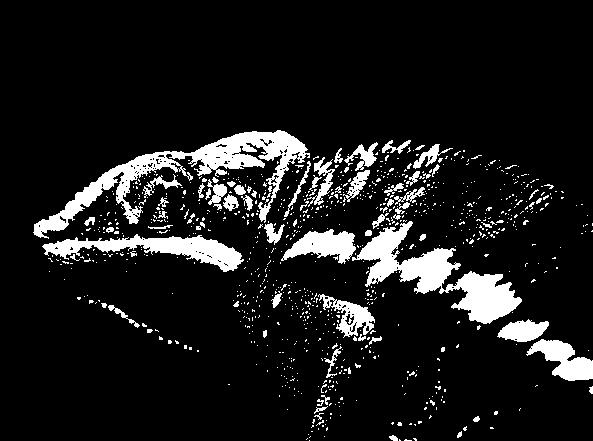

# Simple Photo Filter Library

# Usage

```python
from PIL import Image
from photo_filter import Filterizer, SimpleFilter


image = Image.open("chameleon.jpg")
Filterizer.apply(image, SimpleFilter.negative)
image.save("filterized.jpg")
```

# Examples

## Original photo


Source: [https://www.pexels.com/photo/red-chameleon-567540/](https://www.pexels.com/photo/red-chameleon-567540/)


## Grayscale filters

### Average


### Binary



### Desaturation


### Luminance


### Red channel


### Green channel


### Blue channel


## Simple filters

### Atmosphere


### Blacklight


### Burn


### Color shift


### Freeze


### Lava


### Metal


### Negative


### Ocean


